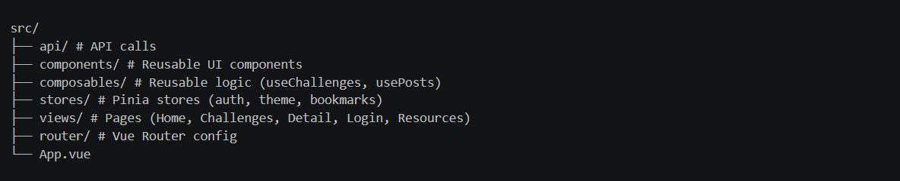
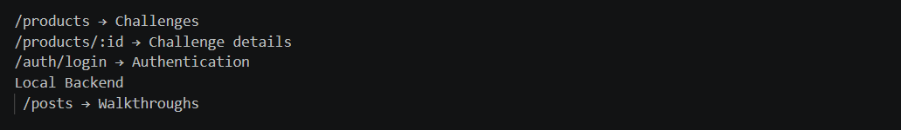
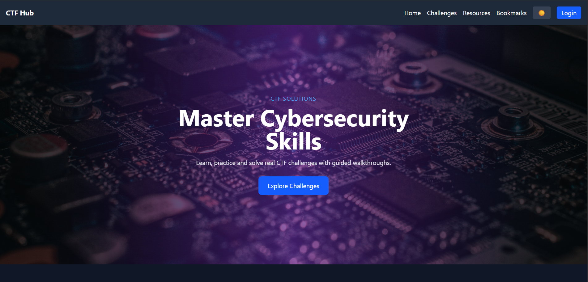
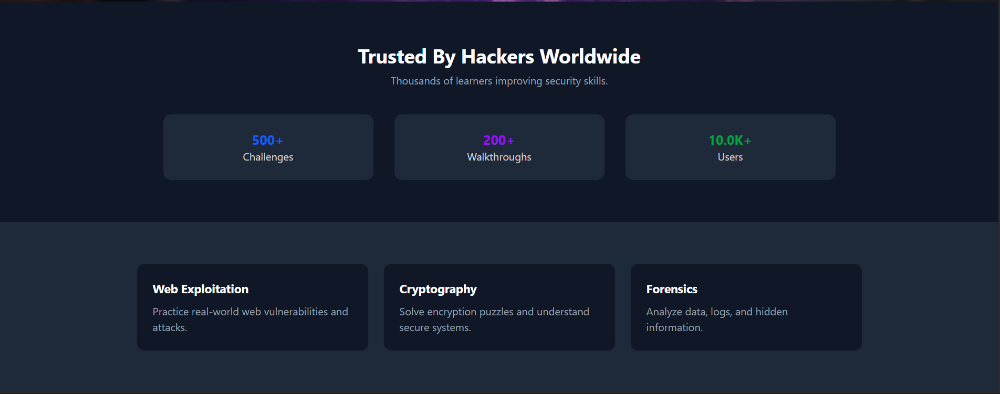
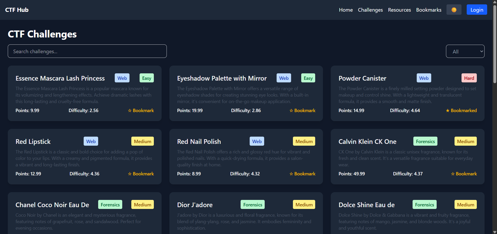
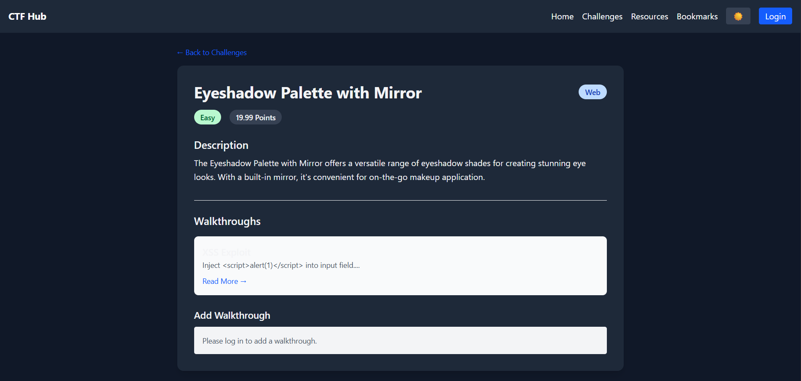
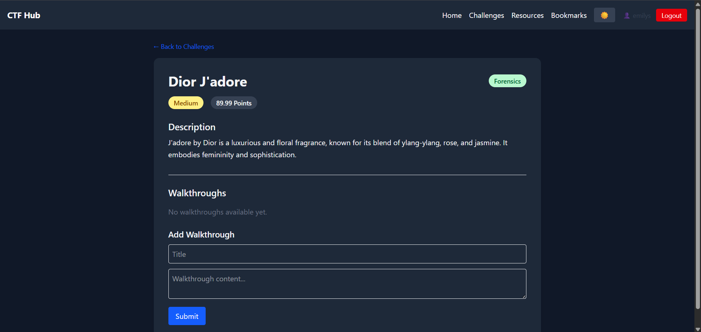
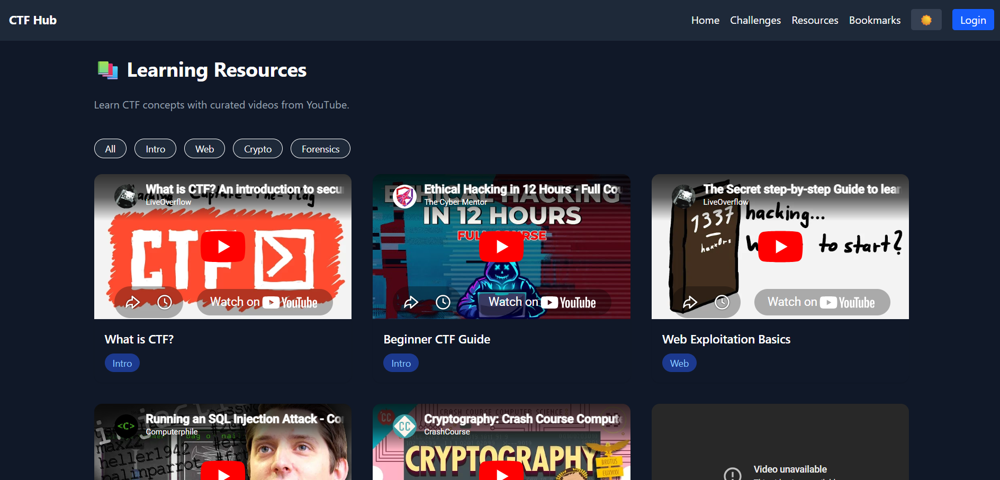
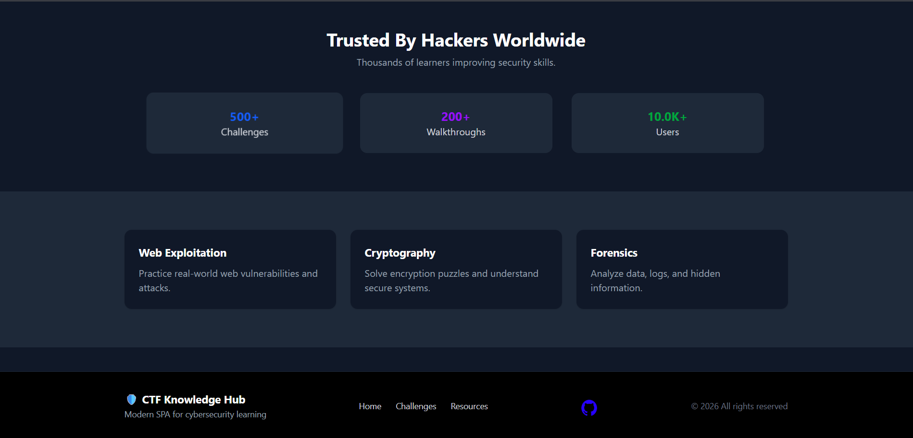
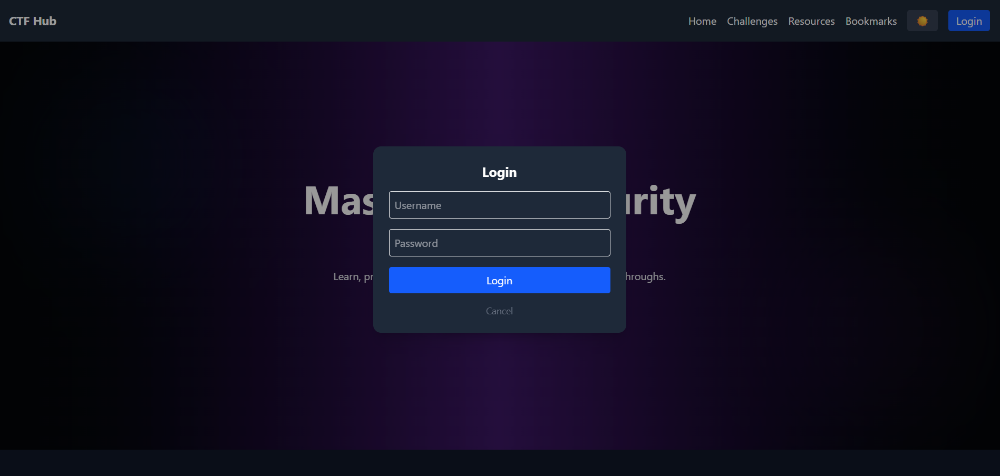

# 🛡️ CTF Knowledge Hub SPA

A modern **Single Page Application (SPA)** built with **Vue 3, TypeScript, and Tailwind CSS** to explore cybersecurity challenges and walkthroughs.

This project demonstrates API integration, state management, responsive UI design, and modern frontend architecture.

----------------------------------------------------------------------------------------

## 🚀 Features

### 🔹 Core Features
- 📦 Fetch challenges from **DummyJSON API**
- 🔍 Search and filter challenges by category
- 📄 Challenge detail page with full information
- 📱 Fully responsive design (mobile, tablet, desktop)

### 🔹 Walkthrough System
- 📝 View walkthroughs related to each challenge
- ➕ Add new walkthroughs (stored in local backend)
- 🔗 Dynamic routing (`/challenge/:id`, `/posts/:id`)

### 🔹 Authentication
- 🔐 Login using DummyJSON `/auth/login`
- 💾 User session stored in `localStorage`
- 🚪 Logout functionality

### 🔹 Global State (Pinia)
- ⭐ Bookmark challenges
- 🔐 Authentication state
- 🌙 Theme (Dark/Light mode)

### 🔹 UI / UX Enhancements
- 🎨 Premium landing page with animations
- 🖼️ Background image slider
- 🌙 Dark mode toggle
- ✨ Smooth transitions and hover effects
- 📚 Resources page with embedded YouTube tutorials

----------------------------------------------------------------

## 🛠️ Tech Stack

- **Frontend:** Vue 3 (Composition API)
- **Language:** TypeScript
- **Styling:** Tailwind CSS
- **State Management:** Pinia
- **Routing:** Vue Router
- **API:** DummyJSON (public API)
- **Local Backend:** json-server

-----------------------------------------------------------------

## 📂 Project Structure

  

--------------------------------------------------------------------

## ⚙️ Installation & Setup

### 1️⃣ Clone the repository
```bash
git clone https://github.com/ashuraweismann/ctf-knowledge-hub.git
cd ctf-knowledge-hub
```
---

### 2️⃣ Install dependencies
```bash
npm install
```
---

### 3️⃣ Run frontend
```bash
npm run dev
```
---

### 4️⃣ Run backend (json-server)
```bash
npm run server
```
-------------------------------------------------------------------

## ⚠️ Requirements

- Node.js (v18+ recommended)
- npm

--------------------------------------------------------------------

## 🌐 API Usage

### DummyJSON Endpoints

  

### 🔐 Test Login Credentials

Use DummyJSON test user:

  username: emilys
  password: emilyspass

-------------------------------------------------------------------------

## 🎯 Learning Outcomes

This project demonstrates:

  Strong TypeScript usage (no any)
  Clean component-based architecture
  API consumption using fetch
  State management with Pinia
  Responsive UI with Tailwind CSS
  Integration of authentication + local backend
  Effective use of AI tools for development

---------------------------------------------------------------------------
## 📸 Screenshots

### 🏠 Home Page


### 🏠 Home Page Scrolled


### 🧩 Challenges Page


### 📄 Challenge Detail (Before Login)


### 📄 Challenge Detail (After Login)



### Resources Page


### Bookmarks Page


### Login Modal



----------------------------------------------------------------------------

## 🤖 AI Usage

AI tools (ChatGPT) were used for:

  Debugging TypeScript errors
  Designing UI components
  Generating Tailwind styles
  Optimizing architecture with composables

Full prompt log is included in prompts.txt.

----------------------------------------------------------------------------

## 📦 Submission Contents

✅ GitHub Repository
✅ Source Code (ZIP)
✅ README.md
✅ Report.pdf
✅ prompts.txt

------------------------------------------------------------------------

## 🏁 Final Notes

  This project simulates a real-world cybersecurity learning platform, combining modern frontend technologies with interactive features and polished UI.